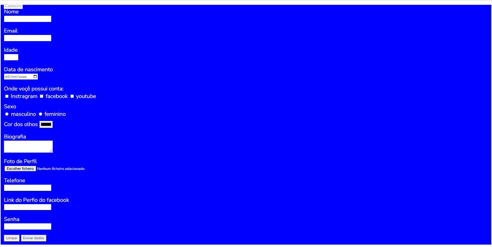
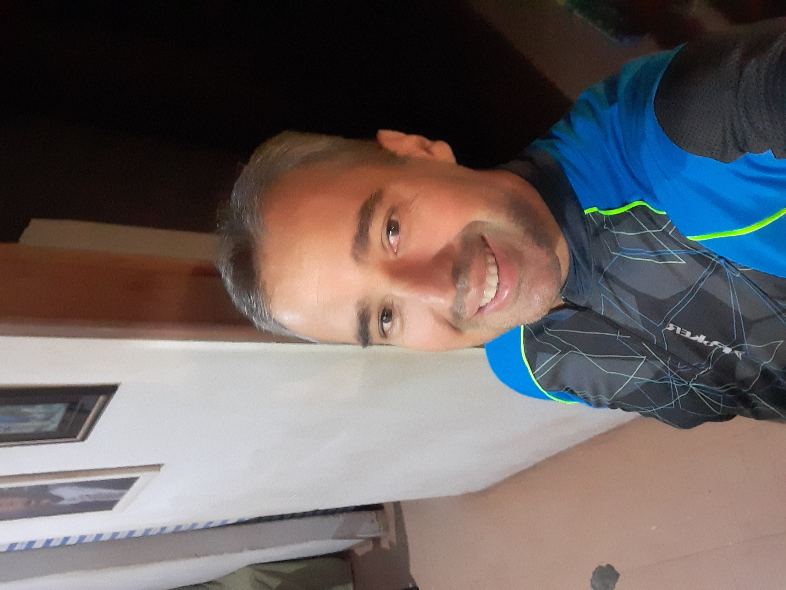

##### MEU SEGUNDO PROJETO FORMULARIO HTML.CSS DEVCLUB

>Resultado do projeto formulario

### Ajustes e melhorias

O Projeto foi desenvolvido com as tecnologia e voltadas nas seguintes tarefas:

- [x] Criação do HTML
- [x] Criação do CSS

 🧑‍💻 Technologies e Tools I use:
 

 
 
 
 

## 🤝 Colaboradores

Agradecemos às seguintes pessoas que contribuíram para este projeto wanderson de farias:

<table>
  <tr>
    <td align="center">
      <a href="#">
         
        
          <b>wanderson de farias</b>
        
      </a>
    </td>
    <a href="https://github.com/wandersondefariasprogramador" Progeto="formulario-devclub">LINK-GITHUB</a>

  </tr>
</table>